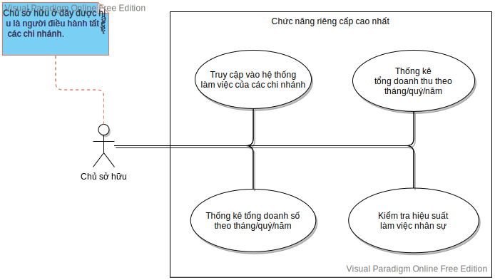
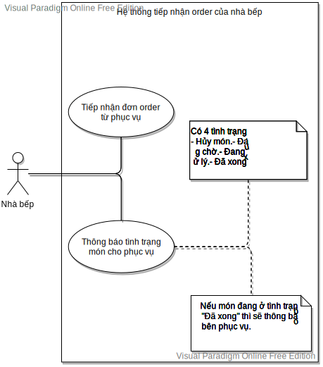

# Hệ thống quản lý quán cà phê

## [ 👉 Truy cập hệ thống](https://hphudev.github.io/coffeeshopmanagement/)

## Giới thiệu
Hệ thống quản lý quán cà phê của chúng tôi sẽ giúp bạn giải quyết bài toán quản lý kinh doanh một cách hiệu quả.
Với chiến lược đáp ứng thực tế cho người dùng, các tính năng của hệ thống sẽ thể hiện rõ ràng các vai trò mà nó vốn có. Ngoài ra, để tránh tình trạng khó sử dụng, đội ngũ thiết kế của chúng tôi đã áp dụng các phương pháp bố trí, màu sắc một cách phù hợp nhất với khách hàng. Mục tiêu mà chúng tôi là thích ứng với bất kỳ loại hình kinh doanh quán cà phê nào. Hướng mà chúng tôi xây dựng chính là chiến lược cho các chuỗi kinh doanh lớn. Tuy nhiên, nếu loại hình kinh doanh của bạn là vừa và nhỏ thì chúng tôi vẫn đáp ứng được.
## Lược đồ tính năng dành cho người dùng
### Lược đồ dành cho chủ sở hữu (người đứng đầu)

### Lược đồ hệ thống xử lý đơn món từ khách hàng của phục vụ

### Lược đồ hệ thống xử lý tiếp nhận order của nhà bếp

### Lược đồ hệ thống dịch vụ thanh toán

### Lược đồ hệ thống quản lý bàn và tiếp nhận đơn đặt bàn

## Tác giả
  - [Leader] *Lê Hoàng Phú - hphudev*
  - [Developer] *Tống Đức Dũng -  ducdung-tong*
  - [Developer] *Mai Công Danh - congdanh1252*
  - [Developer] *Trương Vĩnh Thái - truongvinhthai2506*
## Thông tin thêm
  - **Giảng viên hướng dẫn:** Ths. *Huỳnh Hồ Thị Mộng Trinh*
  - Khoa Công nghệ Phần mềm - Trường Đại học Công nghệ Thông tin (ĐHQG - TPHCM)
